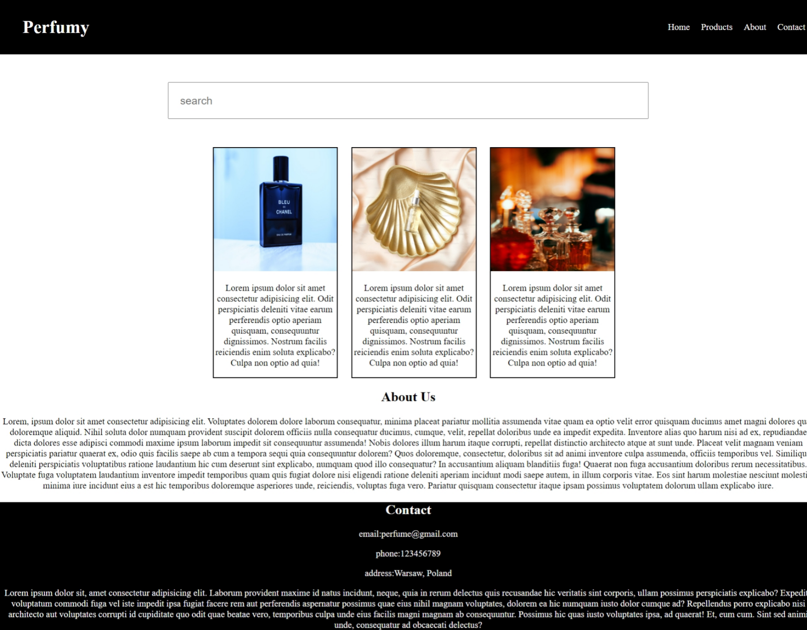

# Perfumy Website Project



This project is a hands-on exercise in building a website using HTML and CSS. I learned various HTML tags and CSS properties including Flexbox, media queries, and more.

## Overview

- **HTML Tags**: Used HTML tags such as `<header>`, `<nav>`, `<section>`, `<article>`, `<footer>`, etc., to structure the webpage.
- **CSS Styling**: Applied CSS properties like `flexbox` for layout and a lot more and learned the basics of css.
- **GitHub Pages**: Hosted the website using GitHub Pages, making it accessible at [Perfumy Website](https://sivashankar-selvan.github.io/perfumy/).

## Project Structure

- `index.html`: Main HTML file that structures the content of the website.
- `style.css`: CSS file containing styles for the website layout and design.
- `perfumy/perfumy.png`: Screenshot of the Perfumy website.

## How to View

To view the website:
1. Click on the [Perfumy Website](https://sivashankar-selvan.github.io/perfumy/) link.

## Development

To contribute or modify the project:
1. Clone the repository:
   ```bash
   git clone https://github.com/sivashankar-selvan/perfumy.git
